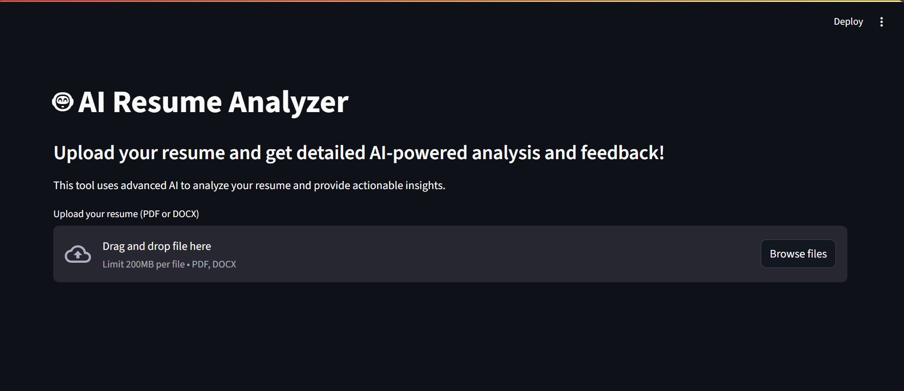

# 🤖 AI Resume Analyzer

[](https://www.python.org/downloads/)
[](https://streamlit.io)
[](https://groq.com)
[](LICENSE)

> A powerful AI-powered resume analysis tool that provides detailed feedback and actionable insights for your resume.



## ✨ Features

- 📄 Upload PDF or DOCX resumes
- 🤖 Advanced AI-powered analysis using Groq
- 📊 Comprehensive feedback on multiple aspects:
  - Overall Score
  - Key Strengths
  - Areas for Improvement
  - Skills Assessment
  - Experience Analysis
  - Education Analysis
  - Format and Presentation
- 💡 Actionable recommendations
- 📥 Downloadable analysis report in JSON format
- 🎨 Beautiful Streamlit UI

## 🚀 Quick Start

### Prerequisites

- Python 3.8 or higher
- Groq API key
- Internet connection

### Installation

1. Clone the repository:
```bash
git clone https://github.com/Misikirayu/AI_resume_analyser.git
cd AI_resume_analyser
```

2. Install dependencies:
```bash
pip install -r requirements.txt
```

3. Set up your environment:
   - Create a `.env` file in the project root
   - Add your Groq API key:
```env
GROQ_API_KEY=your_api_key_here
```

4. Run the application:
```bash
streamlit run app.py
```

## 🎯 Usage

1. Open your browser and navigate to the URL shown in the terminal (typically http://localhost:8501)
2. Upload your resume (PDF or DOCX format)
3. Wait for the AI analysis to complete
4. Review the comprehensive feedback:
   - Overall resume score
   - Identified strengths
   - Areas needing improvement
   - Detailed skills analysis
   - Experience evaluation
   - Education assessment
   - Format and presentation feedback
5. Download the complete analysis report

## 🛠️ Technology Stack

- **Python** - Core programming language
- **Streamlit** - Web interface framework
- **Groq AI** - Advanced language model for analysis
- **PyPDF2** - PDF processing
- **python-docx** - DOCX processing
- **pdfminer.six** - Advanced PDF text extraction
- **python-dotenv** - Environment management

## 🔒 Security Note

- Never commit your `.env` file or expose your Groq API key
- The application uses environment variables for secure credential management
- All resume processing is done locally before sending to the AI

## 📝 License

This project is licensed under the MIT License - see the [LICENSE](LICENSE) file for details.

## 🤝 Contributing

Contributions, issues, and feature requests are welcome! Feel free to check [issues page](issues-url).

## 🌟 Show your support

Give a ⭐️ if this project helped you!

---

<p align="center">Made with ❤️ using Groq AI and Streamlit</p> 